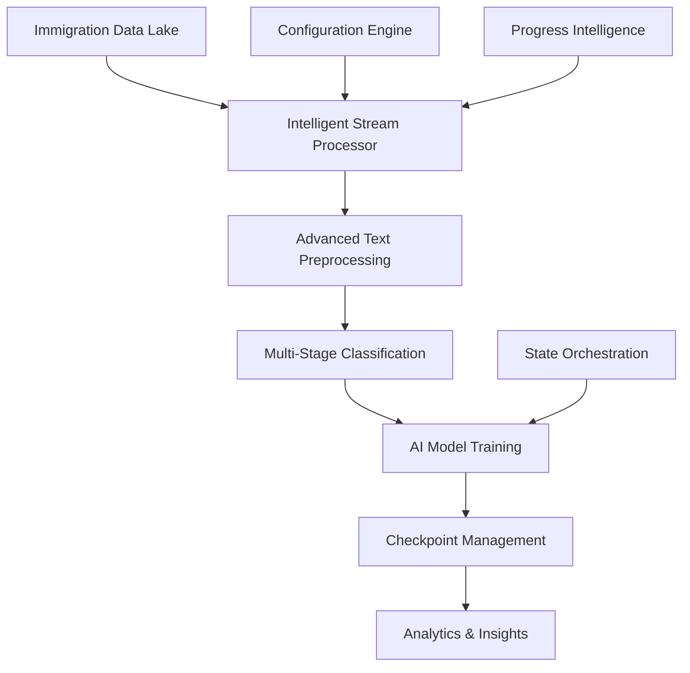

# 🎓 Immigration Journey Analyzer

> **An intelligent machine learning platform for analyzing immigration discussions across the international student life cycle from F1 visa to citizenship.**

[](https://python.org)
[](https://pytorch.org)
[](https://huggingface.co/transformers)
[](LICENSE)

## 🎯 Project Overview

This project analyzes Reddit discussions to understand the international student immigration journey through 5 key stages:

1. **🎓 Student Visa Stage** (F1, CPT, OPT, STEM OPT)
2. **💼 Work Visa Stage** (H1B, Employer Sponsorship) 
3. **🟢 Permanent Residency Stage** (PERM, I-140, Green Card)
4. **🇺🇸 Citizenship Stage** (Naturalization)
5. **⚖️ General Immigration & Legal Issues** (Cross-cutting)

### Key Features

- **🔄 Enterprise-Scale Processing**: Handles 2TB+ datasets with intelligent streaming
- **🧠 Advanced AI**: BERT-based classification with early stopping & mixed precision
- **📊 Real-time Intelligence**: ETA tracking, structured logging, progress persistence
- **🛡️ Production-Grade**: Fault tolerance, resume capability, distributed processing
- **📈 Comprehensive Analytics**: Per-stage metrics, journey mapping, engagement insights

## 🏗️ Architecture



## 🚀 Quick Start

### Prerequisites

- Python 3.9+
- AWS credentials configured
- 8GB+ RAM recommended
- GPU (optional, supports MPS/CPU fallback)

### Installation

```bash
# Clone the repository
git clone https://github.com/sivanaraharisetty/f1-citizenship.git
cd f1-citizenship

# Create virtual environment
python -m venv .venv
source .venv/bin/activate  # On Windows: .venv\Scripts\activate

# Install dependencies
pip install -r requirements.txt
```

### Configuration

Edit `config/config.yaml`:

```yaml
data:
  s3:
    bucket: "your-bucket-name"
    comments_path: "reddit/comments/"
    posts_path: "reddit/posts/"
  chunking:
    files_per_chunk: 10
    rows_per_chunk: 25000

model:
  parameters:
    learning_rate: 2e-5
    epochs: 1
    batch_size: 32

logging:
  level: "INFO"
  log_file: "logs/classifier.log"
```

### Run Analysis

```bash
# Start the immigration journey analysis
python -m src.main

# Monitor real-time progress
tail -f logs/classifier.log
```

## 📊 Data Schema

### Input Data Structure

**Comments Table:**
- `body`: Comment text content
- `link_id`: References post as `t3_<post_id>`
- `subreddit`: Community identifier
- `created_utc`: Timestamp

**Posts Table:**
- `title`: Post title
- `selftext`: Post body content  
- `id`: Unique post identifier
- `subreddit`: Community identifier
- `created_utc`: Timestamp

### Label Taxonomy

| Stage | Labels | Keywords | Subreddits |
|-------|--------|----------|------------|
| **Student** | `student_visa` | F1, CPT, OPT, STEM OPT, I-765 | r/F1Visa, r/OPT, r/stemopt |
| **Work** | `work_visa` | H1B, H-1B, employer sponsor | r/h1b, r/WorkVisas |
| **Permanent** | `green_card` | I-140, PERM, GC, I-485 | r/greencard, r/greencardprocess |
| **Citizenship** | `citizenship` | naturalization, citizenship | r/citizenship |
| **General** | `general_immigration` | visa denial, delays, backlog | r/immigration, r/immigrationlaw |

## 🔧 Advanced Usage

### Custom Configuration

```bash
# Override config file
export CLASSIFIER_CONFIG="/path/to/custom/config.yaml"

# Set custom seed
export SEED=42

# Configure AWS region
export S3_REGION=us-east-1
```

### Resume Analysis

The platform automatically resumes from the last checkpoint:

```bash
# Analysis will resume from results/YYYYMMDD/state.json
python -m src.main
```

### Monitor Large Datasets

For enterprise-scale datasets, the platform provides intelligent ETA tracking:

```
2025-09-23 09:17:10,083 INFO classifier - Estimated unprocessed bytes: 1573001799868
2025-09-23 09:21:09,110 INFO classifier - Processing chunk 0 with 1 files and 791847 rows
2025-09-23 09:25:15,234 INFO classifier - Finished chunk 0. Metrics: {'accuracy': 0.85, 'f1': 0.82}. Speed ~ 45.2 MB/s. ETA ~ 2h 15m
```

## 📈 Results & Analytics

### Output Structure

```
results/YYYYMMDD/
├── chunk_0/                    # Per-chunk checkpoints
│   ├── config.json
│   ├── model.safetensors
│   └── metrics_*.json
├── evaluation_results.json     # Global metrics (JSONL)
├── label_mapping.json         # Class mapping
├── state.json                 # Resume state
└── processed_keys.sqlite     # Progress tracking
```

### Key Metrics

- **Accuracy**: Overall classification accuracy
- **F1-Score**: Weighted F1 across all classes
- **Precision/Recall**: Per-class performance
- **Processing Speed**: MB/s throughput
- **ETA**: Estimated completion time

### Visualization

```python
import pandas as pd
import json

# Load results
results = []
with open('results/20250923/evaluation_results.json', 'r') as f:
    for line in f:
        results.append(json.loads(line))

df = pd.DataFrame(results)
print(df[['chunk_index', 'metrics', 'num_rows']].head())
```

## 🛠️ Development

### Project Structure

```
immigration-journey-analyzer/
├── src/
│   ├── data/
│   │   ├── loader.py          # Intelligent stream processor
│   │   └── preprocess.py      # Advanced text preprocessing & labeling
│   ├── model/
│   │   ├── train.py           # AI model trainer with early stopping
│   │   └── evaluate.py        # Model evaluation & metrics
│   ├── utils/
│   │   ├── helpers.py         # Core utilities & reproducibility
│   │   ├── alerts.py          # Intelligent notifications
│   │   └── processed_store.py # Progress intelligence
│   └── main.py                # Main analysis pipeline
├── config/
│   └── config.yaml            # Configuration engine
├── requirements.txt           # Dependencies
└── README.md                 # This file
```

### Adding New Labels

1. **Update keyword patterns** in `src/data/preprocess.py`:
```python
new_stage_pat = r"(your|new|keywords|here)"
```

2. **Add subreddit mapping**:
```python
subreddit_to_label = {
    "newsubreddit": "new_stage",
    # ... existing mappings
}
```

3. **Test with sample data**:
```bash
python -c "
from src.data.preprocess import preprocess_data
import pandas as pd
df = pd.DataFrame({'text': ['your test text'], 'subreddit': ['newsubreddit']})
result = preprocess_data(df)
print(result)
"
```

## 🔍 Research Applications

### Immigration Journey Analysis

- **Stage Transitions**: Track user progression through immigration stages
- **Pain Points**: Identify common issues at each stage
- **Policy Impact**: Measure effects of policy changes on discussions
- **Community Support**: Analyze help-seeking patterns

### Network Analysis

```python
# Post-Comment Relationships
posts_df = load_posts()
comments_df = load_comments()

# Join posts with comments
joined = comments_df.merge(
    posts_df, 
    left_on='link_id', 
    right_on='id', 
    how='inner'
)

# Analyze engagement
engagement = joined.groupby('id').agg({
    'body': 'count',
    'score': 'sum'
}).reset_index()
```

## 📚 References

### Official Immigration Resources

- [USCIS](https://www.uscis.gov) - Official visa & green card processes
- [Department of State](https://travel.state.gov) - Visa information & embassy contacts
- [SEVP](https://www.ice.gov/sevis) - Student visa compliance
- [Visa Bulletin](https://travel.state.gov/visa-bulletin.html) - Green card wait times

### Academic Papers

- Immigration policy impact studies
- Social media analysis methodologies
- Natural language processing for legal text

## 🤝 Contributing

1. Fork the repository
2. Create a feature branch (`git checkout -b feature/amazing-feature`)
3. Commit your changes (`git commit -m 'Add amazing feature'`)
4. Push to the branch (`git push origin feature/amazing-feature`)
5. Open a Pull Request


## 🙏 Acknowledgments

- Reddit communities for providing valuable discussion data
- Hugging Face for the Transformers library
- AWS for scalable data storage
- The open-source community for foundational tools

---

**⚠️ Important**: This platform is designed for research and analysis purposes. Always comply with Reddit's API terms of service and respect user privacy.


**🔗 Repository**: [https://github.com/sivanaraharisetty/f1-citizenship](https://github.com/sivanaraharisetty/f1-citizenship)
